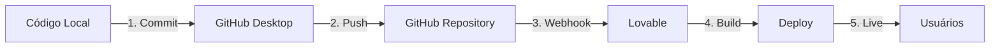

# Workflow: Lovable + GitHub Integration

## 🔄 Visão Geral

Este documento descreve o fluxo de trabalho para desenvolver e deployar atualizações no projeto **Área de Membros - Lovable Infinito** usando a integração entre GitHub e Lovable.

---

## 📋 Pré-requisitos

- [x] Conta Lovable criada via Imagine Labs (55 créditos)
- [x] Repositório GitHub conectado ao Lovable
- [x] GitHub Desktop instalado
- [x] Node.js instalado (para desenvolvimento local)
- [x] Editor de código (VS Code recomendado)

---

## 🚀 Fluxo de Trabalho Completo

### 1. Desenvolvimento Local

#### Passo 1.1: Clone ou Pull do Repositório

```bash
# Se primeira vez
git clone https://github.com/developerslimitada/Area-de-Membros---Produto-Lovable-Infinito.git

# Se já tem o repositório
git pull origin main
```

#### Passo 1.2: Instalar Dependências

```bash
cd Area-de-Membros---Produto-Lovable-Infinito
npm install
```

#### Passo 1.3: Configurar Variáveis de Ambiente

Crie o arquivo `.env.local` (se não existir):

```env
GEMINI_API_KEY=your_gemini_api_key_here
```

> **Nota**: As credenciais do Supabase já estão configuradas em `lib/supabase.ts`

#### Passo 1.4: Rodar Servidor de Desenvolvimento

```bash
npm run dev
```

Acesse: `http://localhost:5173`

---

### 2. Fazer Alterações no Código

#### Boas Práticas

1. **Trabalhe em uma feature por vez**
2. **Teste localmente antes de commitar**
3. **Mantenha commits pequenos e focados**
4. **Use mensagens de commit descritivas**

#### Exemplo de Alterações Comuns

**Adicionar nova página:**
```typescript
// pages/NovaPage.tsx
export default function NovaPage() {
  return <div>Nova Página</div>
}
```

**Atualizar rota:**
```typescript
// App.tsx
<Route path="nova-page" element={<NovaPage />} />
```

**Modificar componente:**
```typescript
// components/StudentNavbar.tsx
// Fazer alterações necessárias
```

---

### 3. Commit via GitHub Desktop

#### Passo 3.1: Abrir GitHub Desktop

1. Abra o GitHub Desktop
2. Selecione o repositório: `Area-de-Membros---Produto-Lovable-Infinito`

#### Passo 3.2: Revisar Alterações

- Veja todos os arquivos modificados no painel esquerdo
- Revise as diferenças (diff) de cada arquivo
- Certifique-se de que apenas arquivos desejados estão sendo commitados

#### Passo 3.3: Escrever Mensagem de Commit

**Formato Recomendado:**

```
<tipo>: <descrição curta>

<descrição detalhada opcional>
```

**Tipos de Commit:**

- `feat`: Nova funcionalidade
- `fix`: Correção de bug
- `docs`: Alterações em documentação
- `style`: Formatação, espaços, etc (sem mudança de lógica)
- `refactor`: Refatoração de código
- `test`: Adição ou correção de testes
- `chore`: Tarefas de manutenção

**Exemplos:**

```
feat: adiciona página de certificados

Implementa visualização e download de certificados
para estudantes que completaram cursos.
```

```
fix: corrige bug na marcação de aula como concluída

O botão de conclusão não estava atualizando o progresso
corretamente no Supabase.
```

```
docs: atualiza README com instruções de deploy
```

#### Passo 3.4: Commit to Main

1. Clique em **"Commit to main"**
2. Aguarde confirmação do commit

---

### 4. Push para GitHub

#### Passo 4.1: Push

1. Clique em **"Push origin"** no GitHub Desktop
2. Aguarde upload completar

#### Passo 4.2: Verificar no GitHub

1. Acesse: https://github.com/developerslimitada/Area-de-Membros---Produto-Lovable-Infinito
2. Verifique se o commit aparece na branch `main`
3. Confirme que os arquivos foram atualizados

---

### 5. Sincronização Automática com Lovable

#### Como Funciona

1. **Lovable detecta push** no repositório GitHub
2. **Inicia rebuild automático** da aplicação
3. **Deploy instantâneo** após build bem-sucedido

#### Tempo Estimado

- **Detecção**: 10-30 segundos
- **Build**: 1-3 minutos
- **Deploy**: 10-30 segundos

**Total**: ~2-4 minutos

#### Verificar Deploy

1. Acesse seu app no Lovable: https://ai.studio/apps/drive/1C-EzLBzrlGY0iCJSQS6Il6vv0asITZq-
2. Aguarde mensagem de "Building..." desaparecer
3. Teste as alterações feitas

---

## 🔍 Troubleshooting

### Problema: Lovable não está sincronizando

**Soluções:**

1. **Verificar conexão GitHub**:
   - Vá em Settings no Lovable
   - Confirme que o repositório está conectado
   - Reconecte se necessário

2. **Forçar rebuild**:
   - No Lovable, clique em "Rebuild"
   - Aguarde processo completar

3. **Verificar branch**:
   - Certifique-se de que está na branch `main`
   - Lovable sincroniza apenas com a branch configurada

### Problema: Build falhou no Lovable

**Soluções:**

1. **Verificar logs de build**:
   - Clique em "View Logs" no Lovable
   - Identifique o erro

2. **Erros comuns**:
   - **Erro de TypeScript**: Corrija tipos no código
   - **Dependência faltando**: Rode `npm install` localmente
   - **Erro de sintaxe**: Verifique código com linter

3. **Reverter commit problemático**:
   ```bash
   git revert HEAD
   git push origin main
   ```

### Problema: Alterações não aparecem após deploy

**Soluções:**

1. **Limpar cache do navegador**:
   - Ctrl + Shift + R (Windows/Linux)
   - Cmd + Shift + R (Mac)

2. **Verificar se alteração foi commitada**:
   - Revise commit no GitHub
   - Confirme que arquivo correto foi modificado

3. **Aguardar propagação**:
   - Pode levar alguns minutos para CDN atualizar
   - Teste em aba anônima

---

## 📝 Checklist de Desenvolvimento

Antes de cada commit, verifique:

- [ ] Código testado localmente (`npm run dev`)
- [ ] Sem erros no console do navegador
- [ ] Sem erros de TypeScript (`npm run build`)
- [ ] Arquivos sensíveis não estão sendo commitados (`.env.local`)
- [ ] Mensagem de commit é descritiva
- [ ] Apenas arquivos relevantes estão no commit

---

## 🎯 Boas Práticas

### 1. Commits Frequentes e Pequenos

✅ **Bom:**
```
feat: adiciona botão de like em posts
fix: corrige alinhamento do header
docs: atualiza instruções de instalação
```

❌ **Ruim:**
```
update: várias alterações e correções
```

### 2. Testar Antes de Commitar

Sempre rode:
```bash
npm run dev    # Testa em desenvolvimento
npm run build  # Verifica se build funciona
```

### 3. Não Commitar Arquivos Sensíveis

**Nunca commite:**
- `.env.local`
- `node_modules/`
- `dist/`
- Chaves de API
- Senhas

**Sempre verifique** `.gitignore` está atualizado

### 4. Usar Branches para Features Grandes

Para mudanças grandes, crie uma branch:

```bash
git checkout -b feature/nova-funcionalidade
# Faça alterações
git commit -m "feat: implementa nova funcionalidade"
git push origin feature/nova-funcionalidade
```

Depois, crie Pull Request no GitHub para revisar antes de mergear

---

## 🔐 Segurança

### Variáveis de Ambiente

**Arquivo**: `.env.local` (local apenas, não versionado)

```env
GEMINI_API_KEY=your_key_here
```

### Credenciais Supabase

**Localização**: `lib/supabase.ts` (hardcoded)

```typescript
const supabaseUrl = 'https://qozsqbmertgivtsgugwv.supabase.co';
const supabaseAnonKey = 'eyJhbGci...'; // Chave pública (safe)
```

> **Nota**: A chave `anon` do Supabase é segura para expor no frontend, pois as permissões são controladas via Row Level Security (RLS) no banco de dados.

---

## 📊 Monitoramento

### Verificar Status do Deploy

1. **Lovable Dashboard**:
   - Status de build (Building/Success/Failed)
   - Logs de deploy
   - Versão atual

2. **GitHub**:
   - Histórico de commits
   - Branches ativas
   - Pull requests

3. **Supabase**:
   - Logs de API
   - Queries executadas
   - Erros de autenticação

---

## 🆘 Suporte

### Recursos

- **Documentação Lovable**: https://lovable.dev/docs
- **GitHub Docs**: https://docs.github.com
- **Supabase Docs**: https://supabase.com/docs

### Contato

- **Email**: developerslimitada@gmail.com
- **Repositório**: [GitHub Issues](https://github.com/developerslimitada/Area-de-Membros---Produto-Lovable-Infinito/issues)

---

## 🎓 Resumo Rápido



**Passos:**
1. Desenvolva localmente
2. Commit via GitHub Desktop
3. Push para GitHub
4. Lovable detecta e rebuilda
5. Deploy automático

**Tempo total**: ~2-5 minutos do commit ao deploy

---

**Última Atualização**: 31 de Janeiro de 2026  
**Versão**: 1.0.0
